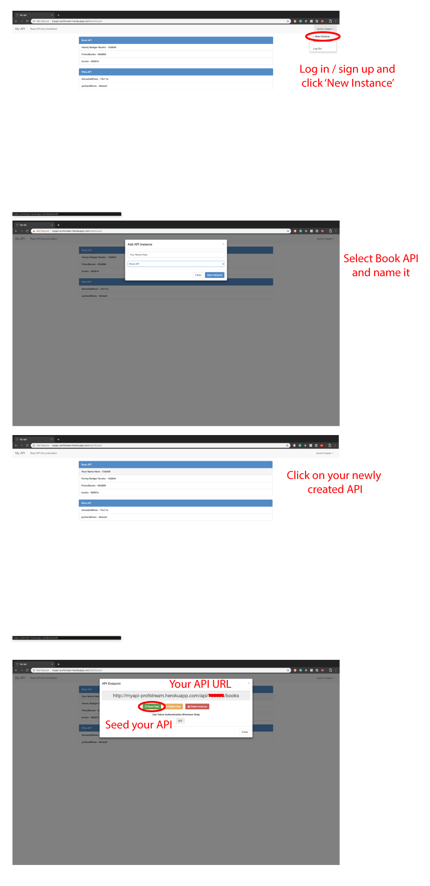

# Reading React!

Tonight you will be creating a reading list for yourself using react!

Use [this api maker](http://myapi-profstream.herokuapp.com/) and create a books api to make your calls to.

## Spec

### [Create This](http://impartial-lunch.surge.sh/)

- All books should be rendered when the page loads
- Hovering on a book loads it's image to the side
- Clicking the `+` on the top nav renders the new form.
- Clicking `cancel` on the form closes the form
- Submitting the form creates a new book and adds it to the rendered books

### Bonus
- clicking on the `x` next to a book deletes it.

## Approach

- Think about your components.
- Where does state live?
- What methods do you need?
- What ajax calls will you need to make?
- DRAW IT OUT!!!

## Submission

Homework is due at 9am!